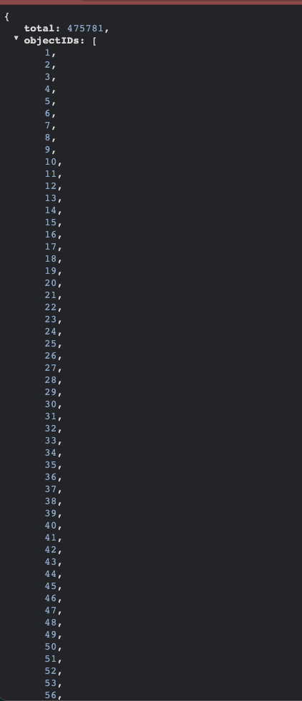

# Project One 🖼️
A simple web app for...

## Technologies 
- HTML 5
- CSS3
- JavaScript/jQuery
- [Met Gallery API]()
(link the text by copy/pasting link into the paraentheses)

 
 

## Screenshots

 
 

### Wireframe

 
  

### Images of Working App

found the link by right clicking 'copy relative path' after dragging image into img folder

## Getting Started

Click [here](#) to see working app
we would be deploying this to the internet 

## Future Enhancements
- Show details in __ format
- blah blah blah